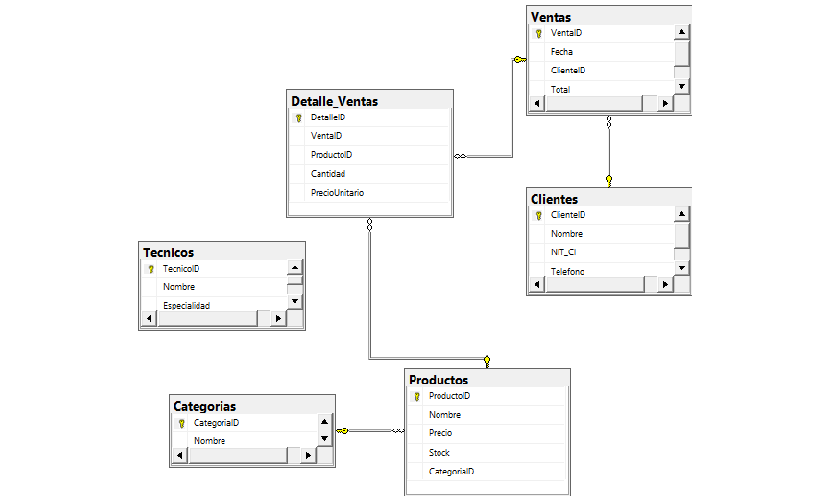

# Mi Proyecto: Gestión de Datos para Soporte Técnico y Repuestos 📱
**Por: Rodrigo Huanca Maldonado**

### Un poco sobre el proyecto
Este trabajo nace de mi experiencia diaria como ingeniero e instructor en el área de mantenimiento de celulares. En el día a día del taller, la desorganización de repuestos y el seguimiento de técnicos es un problema real, por eso decidí enfocar mi proyecto del Módulo 2 en solucionar esto usando SQL Server.

He diseñado esta base de datos pensando en cómo funciona un negocio de verdad: desde que entra un cliente buscando una pantalla, hasta que el técnico termina la reparación y necesitamos analizar si ese repuesto tiene buena rotación.

---

## 🛠️ ¿Qué incluye mi trabajo?

### 1. La Base de Datos (OLTP) - Archivo: 1_Creacion_OLTP.sql
Aquí me enfoqué en que la estructura sea sólida. Apliqué **Tercera Forma Normal (3FN)** para evitar que los datos se repitan. 
* Registré categorías reales como: Pantallas, Baterías, Pines de Carga, etc.
* Creé una tabla de **Técnicos** (donde me incluí como primer técnico) y una de **Productos** con control de stock.
* Las tablas están relacionadas para que no se pierda ninguna venta ni detalle.
* Le puse **20 registros de prueba** para que puedas ver cómo se mueven los datos[cite: 1].

### 2. Análisis de Datos (Data Warehouse) - Archivo: 2_Creacion_DW.sql
Para la parte de Business Intelligence, armé un modelo en **Estrella**. La idea es que el dueño del taller pueda ver reportes rápidos:
* ¿Quién es nuestro mejor cliente?
* ¿Qué mes se vendieron más repuestos?
* ¿Qué categoría es la que más dinero genera?
Uso una tabla de hechos (`Fact_Ventas`) y dimensiones de productos, clientes y tiempo[cite: 1].

### 3. Proyecto DACPAC
Como ingeniero, sé que subir scripts no siempre es lo más eficiente para desplegar. Por eso, generé el proyecto en **Visual Studio 2022** y empaqueté todo en un archivo `.dacpac` (lo encuentras en `bin/Debug`). Es la forma profesional de mover esta base de datos a producción[cite: 1].

---

## 🚀 Cómo ponerlo a correr
1. Primero corre el script `1_Creacion_OLTP.sql` para crear el sistema base[cite: 1].
2. Luego corre el `2_Creacion_DW.sql` para habilitar la parte de análisis[cite: 1].
3. Si prefieres usar Visual Studio, puedes importar el proyecto completo que subí aquí[cite: 1].

#### Diagrama de Entidad-Relación (ER)

**Nota sobre el diseño:** 
Si revisan el diagrama, verán que la tabla **Tecnicos** aparece "suelta". Esto es una decisión de diseño propia: como instructor de mantenimiento, sé que el registro de personal es vital, pero para el alcance de este módulo quise priorizar el flujo de caja y movimiento de repuestos (Ventas y Detalles). La tabla de Técnicos ya está creada y con sus 20 registros[cite: 1], lista para que en una "Fase 2" del proyecto se vincule con una tabla de 'Órdenes de Reparación' que no era obligatoria para esta entrega.

Espero que el diseño les parezca coherente con lo que se busca en este modulo.